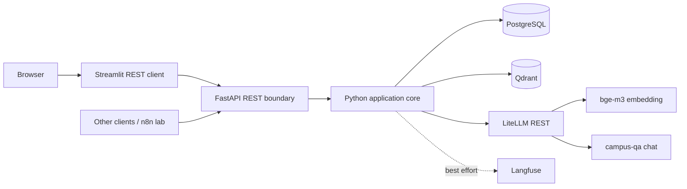

# 系統架構

`legal_qa_platform` 是一套可獨立部署的法規 RAG application。Python 掌握資料契約、同步、檢索、prompt、驗證與對話流程；PostgreSQL、Qdrant、LiteLLM 與 Langfuse 都是可替換的外部服務。框架物件不得進入 domain contract。

## Baseline 範圍



外部服務不會被打包進 application image。PostgreSQL 是法規 master data、keyword retrieval、runs/logs、conversation 與 feedback 的 source of truth；Qdrant 只保存 1024 維向量與最少量可追蹤 payload；LiteLLM 是 embedding/chat gateway；Langfuse 只提供 fail-open observability。

Baseline 明確不使用 reranker、Redis、LangGraph、agent、長期記憶、自動法規收集、Ollama、embeddinggemma、Gemma 4、pgvector runtime vector storage 或 NPY embedding。

## 程式邊界

| Layer | 責任 | 可依賴 | 不可依賴 |
|---|---|---|---|
| Domain | 法規、檢索、回答、citation、conversation 的 typed contract 與不變條件 | Python/Pydantic 純型別 | FastAPI、SQL、HTTP/Qdrant SDK |
| Service | 組合 normalize、retrieval、context、generation、validation、ingestion | Domain contract、port/protocol | Request/Response、具體 credential |
| Adapter | PostgreSQL、Qdrant、LiteLLM、Langfuse I/O | 對應 SDK/HTTP client、Settings | 產品決策與重複的 ranking 規則 |
| API | HTTP schema mapping、dependency wiring、status code | Application service | 自行重作 RAG 邏輯 |
| UI | 經 REST 使用 API | HTTP contract | 直接 import QA service |

主要 package 是 `legal_qa_platform`，REST entry point 是 `legal_qa_platform.api.app:app`；Streamlit client 位於 `src/legal_qa_platform/ui/streamlit_app.py`。CLI、API、UI 與 evaluation 必須共用同一份 service implementation。

## 外部 port

Application core 應只認識能力，而不是產品 SDK：

- `EmbeddingProvider`：輸入文字批次，輸出有限、非零、固定 1024 維向量。
- `ChatModel` / `ModelGateway`：輸入 messages 與必要的 `max_tokens`，輸出待驗證的 model payload。
- `VectorStore`：以 query vector 搜尋 Qdrant candidates，並以 stable `provision_id` 關聯。
- `LegalRepository`：PostgreSQL master data、keyword candidates、snapshot fetch 與同步狀態。
- `ConversationRepository`：conversation、message、feedback 的 application-owned persistence。
- `Observability`：trace/span API；任何 exporter 失敗都被隔離。

替換任一 adapter 時，service input/output 與測試 fixtures 應維持不變。FastAPI 也只是一個 adapter；其決策見 [ADR-0001](adr/0001-fastapi-rest-boundary.md)。

## 兩條主要資料流

查詢路徑：

```text
HTTP request
→ validate request
→ normalize question
→ load bounded conversation context
→ LiteLLM bge-m3 embedding
→ Qdrant vector candidates + PostgreSQL keyword candidates
→ merge / hybrid rank / Top K
→ context extraction
→ prompt + structured-output contract
→ LiteLLM campus-qa (max_tokens required)
→ schema validation + citation allowlist + sanitization
→ persist run/messages/feedback as applicable
→ HTTP response
```

同步路徑：

```text
repository-owned JSON
→ strict validation and governance checks
→ start PostgreSQL run and compare identity/hash/vector state
→ embed changed inputs with bge-m3
→ idempotently stage Qdrant points in the versioned collection
→ transactionally publish PostgreSQL master rows/current generation
→ best-effort vector deactivation cleanup and reconciliation
```

詳細步驟分別見 [data_flow.md](data_flow.md) 與 [ingestion.md](ingestion.md)。

## 識別與一致性

`provision_id` 是跨 PostgreSQL、Qdrant、evaluation、citation 與 trace 的 stable correlation key。`sort_order` 是全域順序；不得將既有 ID 靜默改綁其他條文。Qdrant point 建議直接使用 `provision_id`，payload 至少帶 `content_hash`、embedding model/version 與 current 狀態。

PostgreSQL transaction 無法與 Qdrant transaction 原子提交，因此同步以可重跑的 run/generation、idempotent upsert、hash 與 reconciliation 建立一致性；查詢只讀取成功且現行的 generation。決策見 [ADR-0008](adr/0008-postgresql-qdrant-consistency.md)。

## Availability 與失敗邊界

- `/health` 只確認 application process 能回應，供 liveness 使用。
- `/ready` 確認 PostgreSQL schema與符合profile的成功published snapshot、Qdrant
  service與collection/dimension contract、LiteLLM gateway均可用，供readiness使用；
  不在高頻probe執行model operation。
- PostgreSQL、Qdrant 或 LiteLLM 失效時，QA request 應回傳受控錯誤，不得捏造回答。
- Langfuse 失效時，QA request 照常完成；記錄 exporter failure 的安全類別即可。
- Model 回傳永遠視為不可信；驗證失敗不得把 raw output 當 final response。
- 設定錯誤在啟動或 readiness 階段 fail fast，只列缺少的 variable name。

## Deployment 形狀

同一份 source 與 image 支援兩種 endpoint 選擇：本機/開發使用 external/public endpoint，Kubernetes 使用 internal endpoint。切換只發生在 configuration adapter，domain/service 不知道執行環境。Docker 與 Kubernetes 詳見 [deployment.md](deployment.md)。

## 可替換決策

重要取捨記錄於 [ADR 索引](adr/README.md)。若未來替換 web framework、vector store、keyword engine、observability exporter 或對話策略，先維持既有 port contract 與 acceptance tests，再替換 adapter；不要讓第二套 production retrieval 或 validation implementation 出現。
