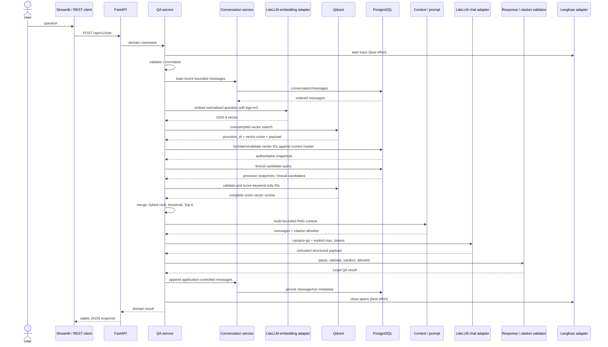
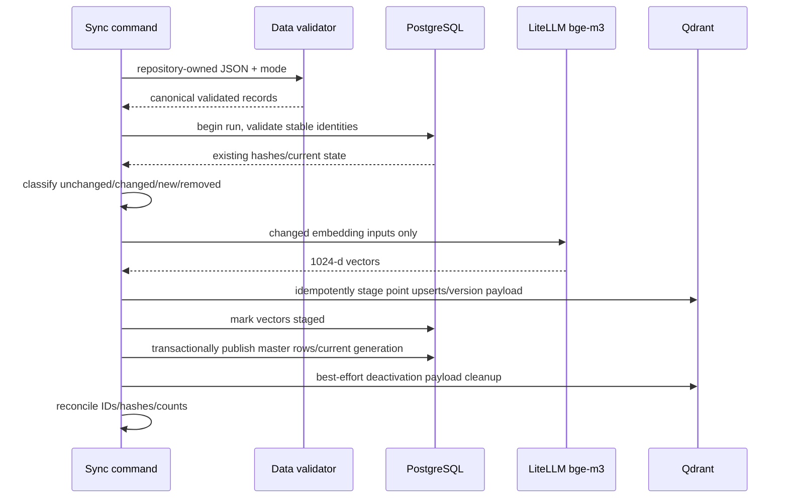

# 端到端資料流

本文件用一筆 QA request 說明資料如何流動、在哪裡驗證，以及故障時從哪一層開始查。每一層只接受上一層的 typed output，不傳遞 framework-specific object 或 credential。

## QA request sequence

## Request state by boundary

| Boundary | Input | Output | Important rejection |
|---|---|---|---|
| API | JSON request | domain command | empty/oversized/invalid fields |
| Normalizer | original question | normalized question | non-string or empty result |
| Conversation | optional conversation identity | recent N ordered messages | unknown/unauthorized identity policy remains external |
| Embedding | normalized text | 1024 finite values | wrong count, NaN/Inf, zero vector, timeout |
| Vector retrieval | vector + candidate limit | candidate IDs/scores | wrong collection/version, unavailable Qdrant |
| Keyword retrieval | normalized query/terms | candidate IDs/lexical signals | unavailable PostgreSQL |
| Hybrid rank | two candidate sets/profile | deterministic ranked list | invalid weights/limits/non-finite score |
| Context builder | ranked provisions/question | bounded untrusted reference blocks | missing ID/content, invalid limits |
| Chat | system/user messages + max_tokens | untrusted payload | HTTP/error/timeout/malformed response |
| Validation | raw payload + retrieval allowlist | safe typed response | schema/citation/sanitization failure |
| Persistence | result/message/run metadata | committed application records | DB failure must be categorized; no credential details |

## Correlation keys

- `provision_id`：跨 master row、Qdrant point、retrieval result、citation 與 evaluation 的 stable key。
- `conversation_id`：跨 chat turns 的 application-owned identity；它不能代替 authentication/authorization。
- request/query/trace ID：將 API response、PostgreSQL run log 與可選 Langfuse trace 關聯，但不應包含個資或 credential。
- content/embedding hash：判斷內容是否變更、向量是否仍符合當前 embedding input/model。

任何 log/trace 只寫 allowlisted metadata。不得記錄 authorization header、設定物件、credential-bearing DSN 或完整環境。

## Context 的兩種來源

Conversation context 與 RAG context 必須分開：

- Conversation context 是使用者前幾輪訊息，用於解讀代名詞或延續問題；由 PostgreSQL 保存並有獨立數量/字數上限。
- RAG context 是本次檢索命中的現行法條；它是唯一可支持法律結論與 citation 的來源。

對話曾提到某條法規，不等於該條法規進入本次 citation allowlist。若要引用，仍須在本次 retrieval result 中。

## No-result 與失敗結果

找不到達到 threshold 的條文時，不應呼叫模型自由回答。服務應回傳 `can_answer=false` 的 typed result（或明確的 domain no-result），citation 為空並說明缺少可支持條文。

Model 格式錯誤、citation 不在 allowlist 或 model 宣稱可回答卻沒有可驗證 citation 時，validator 應降級為不支持的回答或回傳受控 validation error；不得顯示 raw model text。

關鍵 dependency 失效與「找不到答案」是不同類別：前者使用 service-unavailable/adapter error，後者是成功處理但無充分依據。Langfuse exporter 失效則不改變任何 QA result。

## Ingestion sequence

完整快照才允許將未出現在輸入的舊資料標成非現行；部分同步永遠不推論「缺少即刪除」。Qdrant先stage、PostgreSQL後publish：stage期間的新/變更payload若和PostgreSQL current snapshot不符，retrieval會拒絕而非服務stale資料。任一步驟失敗都保留可診斷的failed/incomplete run；orphan staged point可由相同ID重跑收斂。

## 如何追一題

1. 從 API request/query ID 確認輸入與 profile name，不看 request headers。
2. 檢查 normalized question 與 embedding dimension。
3. 比較 Qdrant/PostgreSQL candidate 的 `provision_id` 與各自 score。
4. 檢查 deterministic hybrid ordering、threshold 與 Top K。
5. 確認 context 只含選中的 ID，長條文 excerpt 未改寫原意。
6. 確認 chat request 使用 `campus-qa` 並明確提供 `max_tokens`。
7. 檢查 structured parsing 與 citation allowlist 結果。
8. 最後才看 Langfuse；trace 缺失本身不代表 QA 失敗。
